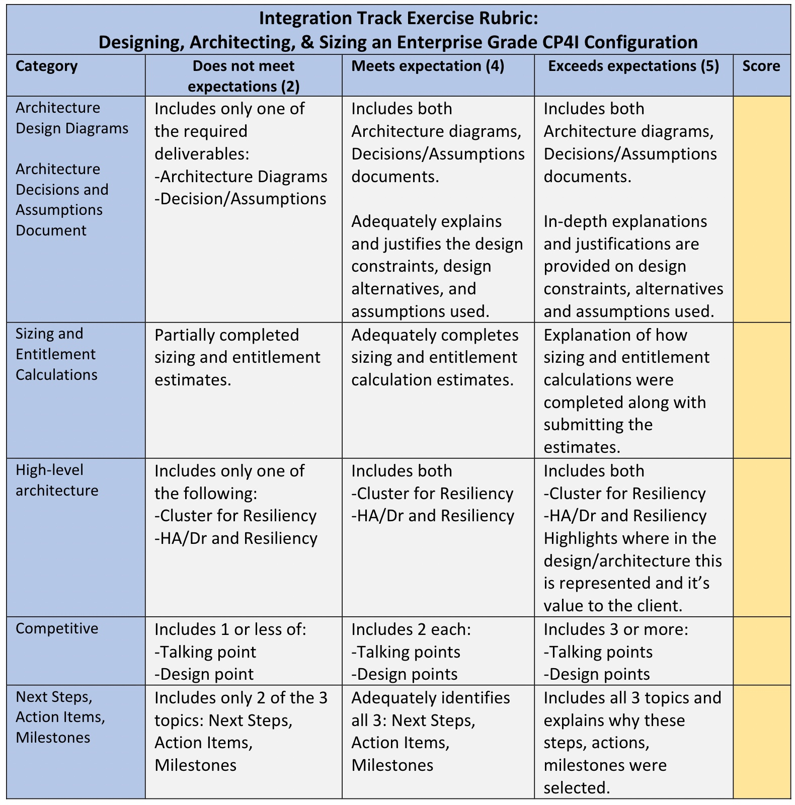

<AnchorLinks>
  <AnchorLink>Synopsis</AnchorLink>
  <AnchorLink>Resources & Presentations</AnchorLink>
  <AnchorLink>Deliverables</AnchorLink>
  <AnchorLink>Goals</AnchorLink>
  <AnchorLink>Guardrails</AnchorLink>
  <AnchorLink>Scoring Criteria</AnchorLink>
  <AnchorLink>Supporting Assets</AnchorLink>
</AnchorLinks>

***

## Synopsis

  - Working in teams of five (5), **evaluate a set of client requirements**, problem statements, goals/outcomes (PoC simulation) to **create a recommended CP4i & integration component configurations**.
  - Develop documentation that reflects your recommendations and captures **key assumptions** and key **design decisions**.
  - Calculate the cluster(s) **sizing requirements** and CP4i licensing **entitlement estimates**.
  - Prepare specific technical recommendations that counter a competitive PoC scenario **against MuleSoft**.
  - Each team will be evaluated on the following <a href="https://ibm.ent.box.com/file/969024649659" target="_blank">Scorecard criteria</a>. **A passing grade is 75%.**

***

## Resources & Presentations

  - <a href="https://ibm.box.com/s/uken0xfa1i7n1i7cutroc1efp4k7x642" target="_blank">Session Overview Presentation</a>

***

## Deliverables

  1. Create key <a href="https://ibm.box.com/s/kjgq175mvpr36bigr1u3u0g1558mrr43">Architecture Diagrams</a> that Illustrate the core elements of the proposed solution. This could include any of the following work product types (these are suggestions only).
     1. Architecture Overview Diagram(s)
     2. Network Diagrams
     3. Topology Diagrams
     4. System Context Diagram

  2. <a href="https://ibm.box.com/s/5kz0q0e33hfrlr5s9rgxlne6ixnbgd1u">Architecture Decisions</a> and key assumptions document

  3. Sizing and Entitlement Calculation Estimates.

  4. Completive Talking Points and Key Design Points to Debunk MuleSoft

  5. Suggested Next Steps, Action Items and Milestones Outline

***

## Goals

  1. Develop deeper skills at assessing a complex client scenario, with complex requirements, with a focus on capturing key design points, architecture decisions and deployment preparation.  

  2. Develop deeper skills focused on RHOCP cluster design recommendations, CP4i design, component design, workload placement recommendations and sizing recommendations.

  3. Developer deeper skills for documenting a set of solution design artifacts which describe the proposed solution (i.e., Architecture Overview Diagram (AoD), Context Diagrams, Topology Views, Architecture Decisions document).  <a href="https://ibm.ent.box.com/folder/164383017863?s=kjgq175mvpr36bigr1u3u0g1558mrr43">Templates & Examples Can Be Found Here</a>.

  4. Develop deeper skills for using the IBM Sales Configurator platform, or other sizing tools, to estimate CP4i licensing entitlement.

  5. Harvest asset examples, best practices and repeating design issues. Community Driven. <a href="https://ibm.box.com/s/6b2re2si75a4lqy5avxsfbg97mnlq20c">Place your work products here</a>.  Locate your Team Number sub-folder.

***

## Guardrails

  1. Approach this exercise as if this is a **simulated client requested PoC** activity.

  2. Teams can use a **live client opportunity** or PoC engagement as a source for requirements. A **fictions scenario** can be provided if necessary.

  3. We are asking for **~8 hours** of effort on this exercise; 4 hours in the Academy followed by ~4 hours  post Academy.

  4. Submit your deliverables **5 business days** after Tech Academy (**June 30**).

  5. Five **(5) key design points** are required with two **(2) optional design** recommendations.

***

## Scoring Criteria

  

***

## Supporting Assets

  - <a href="https://ibm.box.com/s/db3lyzo87d1hnxs30n97wblsotniyvfj" target="_blank">Supporting Resources:  Architecture, Sizing, Documentation</a>
  - <a href="https://ibm.box.com/s/kjgq175mvpr36bigr1u3u0g1558mrr43" target="_blank">Sample Architecture Diagrams</a>
  - <a href="https://ibm.box.com/s/5kz0q0e33hfrlr5s9rgxlne6ixnbgd1u" target="_blank">Architecture Decisions Template</a>
  - <a href="https://ibm.box.com/s/dynuohz6d0kjtc6nrrwq69pqx5bru8bz" target="_blank">Evaluation & Scoring Outline Here.</a>
  - <a href="https://ibm.box.com/s/6b2re2si75a4lqy5avxsfbg97mnlq20c" target="_blank">Place your work products here.</a>
  - <a href="https://ibm.box.com/s/ccyfzdr0oxgibrebdz5izd9be5gu81sa" target="_blank">Fictious DoU Example</a>
  - <a href="https://ibm.box.com/s/dynuohz6d0kjtc6nrrwq69pqx5bru8bz" target="_blank">Scorecard criteria</a>
