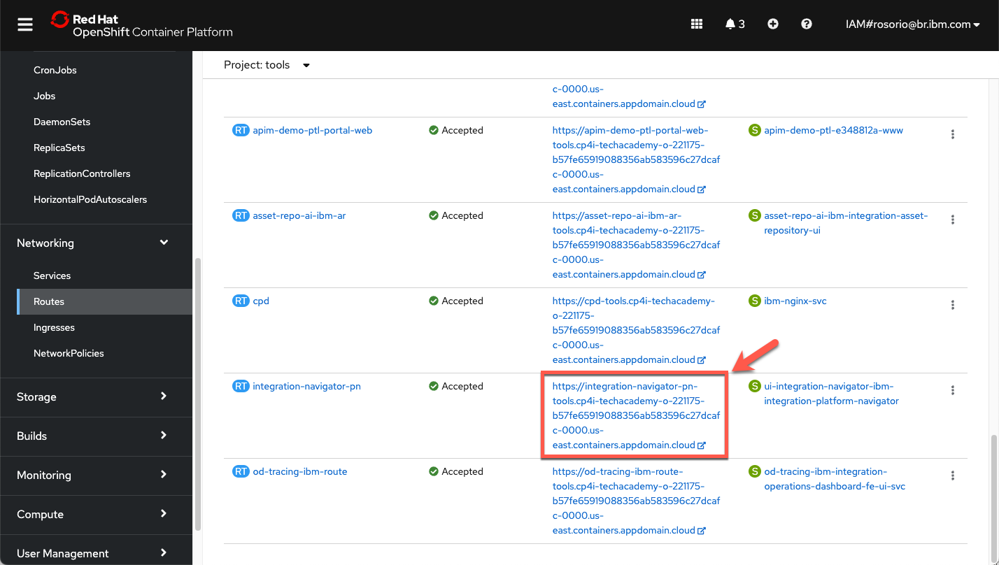
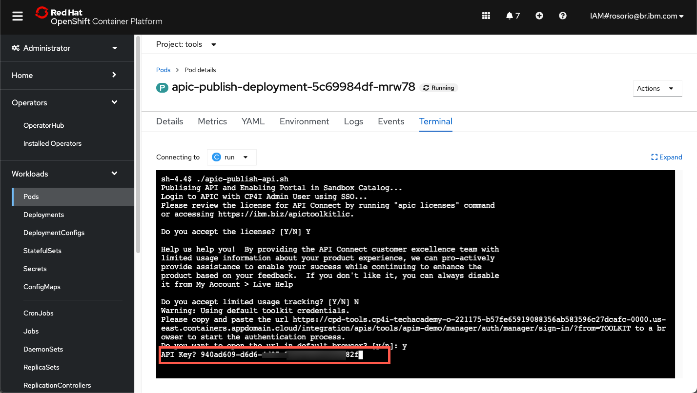
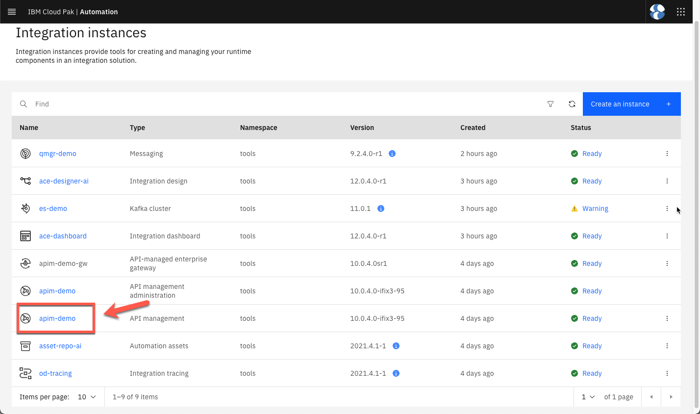
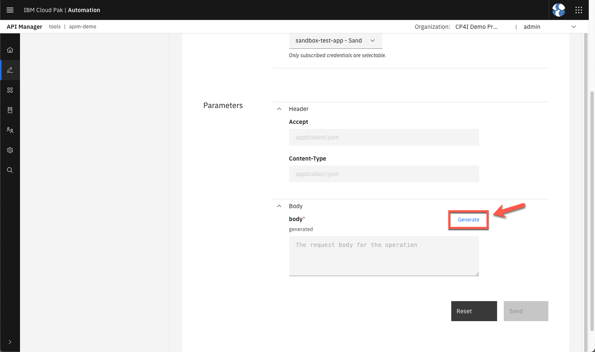
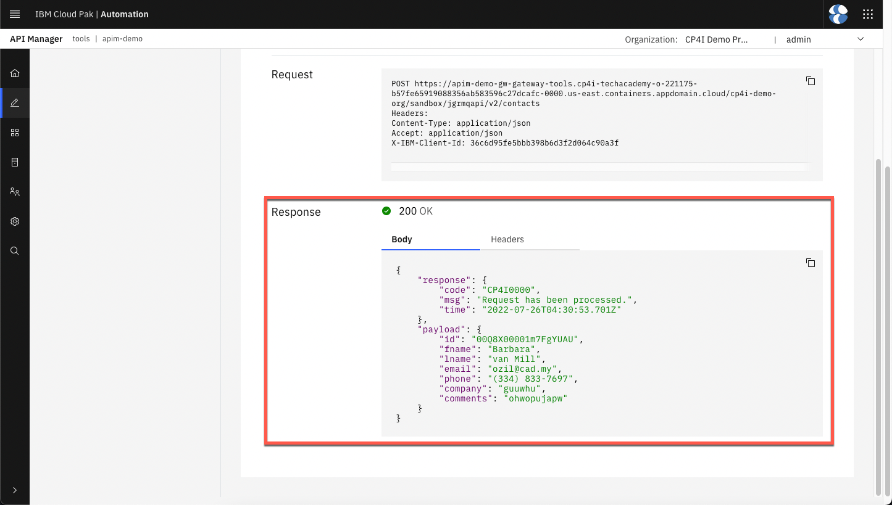

<FeatureCard
  title="Agile Integration Best Practices Using an IBM GitOps Automation Framework"
  color="dark"
  >


</FeatureCard>

<AnchorLinks>
  <AnchorLink>Lab Overview</AnchorLink>
  <AnchorLink>Prerequisites</AnchorLink>
  <AnchorLink>Business Context</AnchorLink>
  <AnchorLink>Automation Framework Introduction</AnchorLink>
  <AnchorLink>Lab Environment</AnchorLink>
  <AnchorLink>0 - Preparation</AnchorLink>
  <AnchorLink>1 - Clone Repositories</AnchorLink>
  <AnchorLink>2 - Explore the Environment</AnchorLink>
  <AnchorLink>3 - Prepare the Subscription</AnchorLink>
  <AnchorLink>4 - Deploy ACE and ES instances</AnchorLink>
  <AnchorLink>5 - Activate MQ Queue Manager</AnchorLink>
  <AnchorLink>6 - Customize Event Streams</AnchorLink>
  <AnchorLink>7 - Configure ACE</AnchorLink>
  <AnchorLink>8 - Customize APIC</AnchorLink>
  <AnchorLink>9 - Check the Demo Assets</AnchorLink>
  <AnchorLink>Summary</AnchorLink>
</AnchorLinks>

***

## Lab Overview

Have you received requests to deliver a Multi-style Integration demo or PoC, and you don’t know how to quickly prepare this environment? You are on the right place. In this session,  you will learn how to prepare a demo/PoC environment using GitOps automation framework. This environment will include different assets, capabilities, services and applications of IBM Cloud Pak for Integration.

The first main goal of this session is to provide you a complete CP4I environment with multiple demo assets to be ready to progress your sales opportunity. This first goal is achieved by reusing a <a href="https://github.ibm.com/joel-gomez/cp4i-demo" target="_blank">multi-style integration demo assets</a>.

The second goal is to provide this environment quickly and easily, by using the GitOps automation framework, more details <a href="https://production-gitops.dev/" target="_blank">here</a> about Cloud Pak Production Deployment Guides.

This document was created for Senior Technical Specialists, and we know you are one of them. Because of that, instead to have very detailled steps, we have high level directions about what you need to do. There are some challenges that we don't explain how to do them, but we are pretty sure that you can do it! But let the proctors know if you have any issue to complete the challenges.

As part of the evalution process of this session, at the end, you will need to capture and upload screenshots of your final progress. In this document, you will see some references about the necessary screenshots.

In this session you will learn:
  - the IBM opinionated point of view regarding a GitOps centric method to manage RHOCP infrastructure, IBM integration software and application workload code (three tier GitOps architecture).
  - how to develop, review, and extend an IBM GitOps automation repository that incapsulate key software components within the IBM Integration portfolio.
  - how to position a GitOps automation framework as a key boot-strapping and operational mechanism supporting a Client PoC activity and Client adoption.

***

## Prerequisites

- You need to have an OpenShift environment with GitOps operators. For this session, your proctor will provide you a pre-installed environment, with admin access (more details below). If you want to create your personal environment, check this <a href="https://www.youtube.com/watch?v=SmDE80vuP3w" target="_blank">video</a> or follow the preparation section from this <a href="https://github.com/sko-master/multi-tenancy-gitops/blob/master/doc/sko-scenario.md" target="_blank">documentation</a>.
- You need to have installed in your machine:
  - <a href="https://docs.openshift.com/container-platform/4.8/cli_reference/openshift_cli/getting-started-cli.html" target="_blank">oc CLI</a> v4.6+.
  - github CLI
  - Bash Shell
  - JAVA v8+
  - <a href="https://stedolan.github.io/jq/" target="_blank">jq CLI</a>
- You need to have a SalesForce account. This should have been completed as part of the <a href="https://ibm-garage-tsa.github.io/cp4i-demohub/salesdemos/carrepair-new/prepare/#setting-up-salesforce" target="_blank">Tech Academy pre-requisite work</a>.
- You need to have a mailtrap account. This too should have been completed as part of the <a href="https://mailtrap.io/" target="_blank">Tech Academy pre-requisite work</a>.
- You have access to GitHub Organization with all repositories. Your proctor will provide that for you.

***

## Business Context

This document describes multiple use cases that highlight the multi-style integration patterns needed by an Integration Specialist to implement a digital transformation initiative that showcase the value Cloud Pak for Integration can provide.

In this case a customer has a system of record that has used for many years which ws designed to work with MQ to process requirements, and now they want to extend the application to expose an API in a asecure way as part of their mobile app.

But the requirement doesn't end there, they are also implementing a new CRM system as a Service and they want to keep both systems in sync without having to modify the original system of record.

Additionally as part of their digital transformation initiative they want to stay closer to their clients and they want to send email notifications when the client is taking certain actions in their mobile app. To support this strategy, the enterprise architecture team wants to implement an event backbone, as part of their event driven architecture.

The following diagram provides a high level view of the scenario:
  

In order to implement this demo you will need to deploy an instance of each one of the following components in your OCP Cluster:
  - API Connect Cluster
  - Event Streams Cluster
  - Queue Manager
  - App Connect Enterprise Integration Servers

The following diagram provides a high level implementation view of the scenario with the core capabilities:
  

To demonstrate the added value capabilities provided by CP4I you will deploy an instance of the following components in your OCP Cluster:
  - Platform UI (formerly known as Platform Navigator)
  - Automation Foundation Assets (formerly known as Asset Repository)
  - Operations Dashboard

***

## Automation Framework Introduction

### What are the Production Deployment Guides?

The <a href="https://production-gitops.dev/" target="_blank">Cloud Pak Production Deployment Guides</a> document and demonstrate how to design, deploy and operate cloud-native solutions leveraging IBM Cloud Pak capabilities in Red Hat OpenShift environments. The guides focus on Production level qualities of services such as High Availability, Security and Performance including how to design, install and manage your Cluster in the popular managed and unmanaged Cloud environments as well as tackling disconnected or air-gapped environments.


### Production Deployment Guide objectives

There are a number of objectives behind providing the Production Deployment Guides. The three main goals of the Guides are provided below:
  - Provide opinionated, validated Production topologies
  - Provide a GitOps driven automation framework
  - Enable IBMers to setup Production topologies


### What is GitOps?

GitOps requires us to describe the entire system declaratively in Git where the desired system state is versioned, managed and applied by software agents.

Automation is key for scale in the Cloud world and OpenShift and Cloud Paks are no different. The implementation code and artifacts provided along with these guides are based on a GitOps approach where infrastructure and everything deployed in to an OpenShift Cluster (including Cloud Paks) is described as code and is managed in the same way that application code would be.

More information on the gitops structure can be read in this <a href="https://production-gitops.dev/gitops/structure/" target="_blank">page</a>.

***

## Lab Environment

For this session you will use a ROKS 4.8 environment with 5 nodes (b3c.16x64). Following this video, you can have a personal environment for you, including GitOps operator and configuration. But for this section, your lab proctors pre-installed this cluster for you. They already installed GitOps, created an empty GitHub Organization and forked the automation repositories that you will use, for this empty organization (check the video to see the steps already completed).

Because of time restrictions, the proctors already installed some core services of Cloud Pak for Integration, avoiding you to wait almost 90 minutes to complete this installation. In the previous sections, you will check what are installed in this environment.

***

## 0 - Preparation

In this section you will do some initial steps to prepare your environment for the lab, including accept the Account Invitation in IBM Cloud, access your cluster web console and by command line interface. Let’s start it!

1. Log in <a href="https://cloud.ibm.com/" target="_blank">IBM Cloud</a>.

2. Open the **Notifications** page (click on top right ring bell icon).


3. On the Notifications page, you should have an **Account** notification informing you that “You are invited to join an account in IBM Cloud”. Select this notification and click the **Join now** link.


4. Follow the steps to accept the invitation.

5. Now back to the IBM Cloud dashboard, change your IBM Cloud account to **2543884 - itztsglenablement05**.


6. Now, click <a href="/tech-academy-japan/environments/" target="_blank">here</a> to open the **Team Environments** page.

7. Open your Team's section (A) (check the number of your team with the Lab's proctors). Take notes of your Team's Github organization name (B), you will use it in next section. Then, open your team's **Cluster page** (C).


8. On your cluster’s page, click **OpenShift web console**.


9. Great, you are almost ready for the lab. Last but not least important, let’s copy login command to access the cluster by CLI. On the top right, click your **username** and select **Copy login command**.


10. Click **Display Token**.


11. Copy the **Log in with this token** command  and paste on a terminal window.


   `Notes`: You should have received an invitation for the GitHub Organization of your team. Don't forget to accept it in your Github account email.

   That is it! Now you are ready for the lab. Take a breath and enjoy your lab!

***

## 1 - Clone Repositories

1. As explained before, you already have Github repositories for your team. On previous section, you took notes of your GitHub organization's name. Now that you have the name, let's clone the repositories in your local machine. Back to the terminal window, use the command below to define your GIT_ORG variable.

```
export GIT_ORG={REPLACE_WITH_YOUR_GIT_ORG}
```

2. Now let's clone the repositories to your local machine.
```
mkdir ${GIT_ORG}
cd ${GIT_ORG}
git clone https://github.com/${GIT_ORG}/multi-tenancy-gitops
git clone https://github.com/${GIT_ORG}/multi-tenancy-gitops-infra
git clone https://github.com/${GIT_ORG}/multi-tenancy-gitops-services
git clone https://github.com/${GIT_ORG}/multi-tenancy-gitops-apps
```

3. You are welcome to explore all the four repositories of the GitOps Automation framework.


***

## 2 - Explore the Environment

Now that you have all the repositories locally, let's check what have been deployed.

1. Let's start by exploring the GitOps Automation Framework YAML files. First, let's check the kustomization.yaml in infra layer (/multi-tenancy-gitops/0-bootstrap/single-cluster/1-infra/).

```
vi multi-tenancy-gitops/0-bootstrap/single-cluster/1-infra/kustomization.yaml

```

  Check that **tools** and **ibm-common-services** are the namespaces enabled. We will explore these namespaces in OpenShift later. Go ahead and close vi.


2. Let's explore the kustomization.yaml in services layer (/multi-tenancy-gitops/0-bootstrap/single-cluster/2-services/)

```
vi multi-tenancy-gitops/0-bootstrap/single-cluster/2-services/kustomization.yaml

```

  Here you can check that Platform Navigator, Asset Repository, API Connect and others are already installed in your environment. Don't worry, in next steps you will install other operators and create new instances.


3. Let's check the installed operators in your Cluster Web Console. You should have the web console page opened, if not, there is a URL available in the Team Environments page.

  On Web Console page, open **Operators** (A), then **Installed Operators** (B). Here you can see all the installed operators (C).


4. Now, let's open the ArgoCD UI. Let's get the ArgoCD Admin's password first. On Web Console page, open **Workloads** (A) > **Secrets** (B).


   Filter by **openshift-gitops** project (A) and open the **openshift-gitops-cntk-cluster** (B).


   Scroll down and click to copy the **admin.password**. You are welcome to take note of this password.


5. Now, let's get the ArgoCD URL. Open **Networking** (A) and **Routes** (B).


   Click on the **openshift-gitops-cntk-server** location to open the ArgoCD URL.


  If necessary, accept all the risks, and log in with **admin** user and the password that you copied in the previous step. `Note:` Don't log in via openshift, because your openshift user doesn't have write permission.


6. Now, you are in Argo CD. Argo CD is a declarative, GitOps continuous delivery tool for Kubernetes. Here you can see all the applications. In Argo CD, application definitions, configurations, and environments should be declarative and version controlled. Application deployment and lifecycle management should be automated, auditable, and easy to understand.

   As you can see, you have 20 **healthy** applications in your environment (A), including **ibm-platform-navigator** (B). You are welcome to explore the Applications tiles page to see the other applications available.


7. Great, now let's check your Cloud Pak for Integration environment. First we need to get the Platform Navigator URL and password. Let's do it! Back to the OpenShift Web Console, open **Workloads** (A) and **Secrets** (B) again.


   Now filter by **tools** project (A) and open the **ibm-iam-bindinfo-platform-auth-idp-credentials** secret (B).


   Scroll down and click to copy the **admin_password**. You are welcome to take note of this password.


8. Now, let's get the Platform Navigator URL. Open **Networking** (A) and **Routes** (B).


   Scroll down and click on the **integration-navigator-pn** location to open the Platform Navigator.



   If necessary, accept all the risks, and click **IBM provided credentials (admin only)** link.


   Log in with **admin** user and the password that you copied in the previous step.


9. Now, let's explore the CP4I. Close the **Welcome** dialog.


   Let's check the instances available. Click on **Integration instances** link.


   Great, here you can check that your API Management (including Gateway and Admin), Automation Assets and Integration tracing are **Ready** to be used.


***

## 3 - Prepare the Subscription

Now it's your time to do some actions using the GitOps Automation Framework. Let's start by preparing some subscriptions.

1. Edit **multi-tenancy-gitops/0-bootstrap/single-cluster/2-services/kustomization.yaml**.

```
cd multi-tenancy-gitops
vi 0-bootstrap/single-cluster/2-services/kustomization.yaml
```

2. Uncomment the lines below to enablle the ACE, MQ and Event Streams operators. Then close and save the YAML file.
```
- argocd/operators/ibm-ace-operator.yaml
- argocd/operators/ibm-eventstreams-operator.yaml
- argocd/operators/ibm-mq-operator.yaml
```

3. In the multi-tenancy-gitops folder: Add, Commit and Push the changes to multi-tenancy-gitops repository.
```
git add .
git commit -m "adding new operators"
git push origin
```

4. Now let's check the operators installation in Argo CD. Back to the Argo CD console, refresh the **02-Services** application. Maybe you need to wait few minutes to make sure that all the status are Sync and Healthy, before progressing.


   When completed, you should have **23** healthy applications (A), including *ibm-ace-operator*, *ibm-mq-operator* and *ibm-eventstreams-operator* (B).


5. Back to the OpenShift Web console, open again **Operators** (A), **Installed Operators** (B). Check the new three operators in the list (C).


***

## 4 - Deploy ACE and ES instances

Now, let's create App Connect Enterprise and Event Streams instances using the GitOps Automation Framework.

1. Back to the terminal window. In *multi-tenancy-gitops*, edit the file below.
```
vi 0-bootstrap/single-cluster/2-services/kustomization.yaml
```

2. In the CP4I for SKO section, uncomment the lines below. Then close and save the YAML file.
```
- argocd/instances/es-demo.yaml
- argocd/instances/ace-infra.yaml
```

3. In the multi-tenancy-gitops folder: Add, Commit and Push the changes to multi-tenancy-gitops repository.
```
git add .
git commit -m "deploying ace and es"
git push origin
```

4. Back to the argoCD console, refresh the **02-Services** application. Maybe you need to wait few minutes to make sure that all the status are Sync and Healthy, before progressing.


   When completed, you should have **25** healthy applications (A), including *es-demo* and *ace-infra* (B).


5. Now, let's check the new instances in CP4I Platform Navigator. Refresh the Integration instances pages (Menu > Administration > Integration instances), and check if the new instances are available and ready. `Note`: ignore the warning in Kafka cluster, it is only informing about a new version.


***

## 5 - Activate MQ Queue Manager

Now, let's start the application layer. First we need to create the MQ Queue Manager.

1. Back to the terminal window. In *multi-tenancy-gitops*, edit the file below.
```
vi 0-bootstrap/single-cluster/3-apps/kustomization.yaml
```

2. In the *SKO sample apps* section, uncomment the line below. Then close and save the YAML file.
```
- argocd/sko-sample/mqmgr.yaml

```

3. In the multi-tenancy-gitops folder: Add, Commit and Push the changes to multi-tenancy-gitops repository.
```
git add .
git commit -m "mq queue manager"
git push origin
```

4. Back to the argoCD console, refresh the **03-Application** application. Maybe you need to wait few minutes to make sure that all the status are Sync and Healthy, before progressing.


   When completed, you should have **26** healthy applications (A), including *mqmgr* (B).


5. On the OpenShift Web Console page, open **Workloads** (A), and **Pods** (B).


   Filter by **qmgr-demo** pods (A) and check if they are running (B).


6. On the CP4i Platform Navigator page, refresh the Instagration instances page and open the **qmgr-demo**.


   On the MQ Console, click on **Manage QMGRDEMO**.


   Here you can check the Queue Manager.


***

## 6 - Customize Event Streams

Now, let's create the Event Streams resources for our Multi-Style demo.

1. Back to the terminal window. In *multi-tenancy-gitops*, edit the file below.
```
vi 0-bootstrap/single-cluster/3-apps/kustomization.yaml
```

2. In the *SKO sample apps* section, uncomment the line below. Then close and save the YAML file.
```
- argocd/sko-sample/eventstream.yaml

```

3. In the multi-tenancy-gitops folder: Add, Commit and Push the changes to multi-tenancy-gitops repository.
```
git add .
git commit -m "customize ES"
git push origin
```

4. Back to the argoCD console, refresh the **03-Application** application. Maybe you need to wait few minutes to make sure that all the status are Sync and Healthy, before progressing.


   When completed, you should have **27** healthy applications (A), including *eventstream* (B).


5. Open the **eventstream** application.


   Open the **es-demo-setup-job-???** pod.


   Open the **LOGS** tab.


6. You should see a failure that statefulsets.apps is forbidden.


   Let's fix it! Back to the terminal window, go to the *multi-tenancy-gitops-apps* folder and edit the file below.
```
cd ../multi-tenancy-gitops-apps/
vi sko-sample/eventstream/es-demo-setup-job-sa-role.yaml
```

7. In the Rules section, create a new rule with the content below and save the new YAML file.
```
- apiGroups: ["apps"]
  resources: ["statefulsets"]
  verbs: ["get", "watch", "list"]
- apiGroups: ["route.openshift.io"]
  resources: ["routes"]
  verbs: ["get", "watch", "list"]
```


8. In the multi-tenancy-gitops-apps folder: Add, Commit and Push the changes to multi-tenancy-gitops-apps repository.
```
git add .
git commit -m "adding rules"
git push origin
```

9. Back to the argoCD console, refresh the **eventstream** application. Maybe you need to wait few minutes to make sure that all the status are Sync and Healthy.


10. Now you need to delete **es-demo-setup-job** to re-run the pod. Open the context menu in **es-demo-setup-job** (A) and select **Delete** (B).


   Enter **es-demo-setup-job** (A) to confirm the deletion and click **OK** (B).


   Wait few seconds to recreate the job and pod. When ready, click on the **es-demo-setup-job-???** pod again.


   Open the **LOGS** tab again.


   Great! Now you should not see any error message.


***

## 7 - Configure ACE

Now, let's work with Application Connect Enterprise. In this part, you are configuring artifacts, secrets and certificates.

1. Back to the terminal window. In *multi-tenancy-gitops-apps* folder, open the folder below.
```
cd sko-sample/ace-00-configs/
```

2. Execute the commands below to generate the configuration YAML files. Where:
    - SF_USER is *[Email addess used to log into Salesforce]*
    - SF_PWD is *[Password used to log in][token received in email]*
    - SF_CLIENT_ID is *[Consumer Key]*
    - SF_CLIENT_SECRET is *[Consumer Secret]*
    - MAILTRAP_USER is *[Mailtrap SMTP User]*
    - MAILTRAP_PWD is *[Mailtrap SMTP Password]*

```
./06-ace-config-barauth-github.sh
./07-ace-config-policy-mq.sh
SF_USER=<my-sf-user> SF_PWD=<my-sf-pwd> SF_CLIENT_ID=<my-sf-client-id> SF_CLIENT_SECRET=<my-sf-client-secret> SF_LOGIN_URL="https://login.salesforce.com" ./08-ace-config-accounts-sf.sh
./10-ace-config-policy-es-scram.sh
./11-ace-config-setdbparms-es-scram.sh
./12-ace-config-truststore-es.sh
./13-ace-config-policy-udp.sh
./14-ace-config-policy-email.sh
MAILTRAP_USER=<user> MAILTRAP_PWD=<pwd> ./15-ace-config-setdbparms-email.sh
```

3. Verify that there are 9 YAML files generated in the *ace-00-configs* folder.
```
ls *.yaml
```


4. Edit **multi-tenancy-gitops-apps/sko-sample/ace-00-configs/kustomization.yaml** file.
```
vi kustomization.yaml
```

5. Uncomment the lines below (all the content). Then save and close the YAML file.
```
- ace-config-accounts-designer.yaml

- ace-config-policy-es-scram.yaml
- ace-config-setdbparms-es-scram.yaml
- ace-config-truststore.yaml

- ace-config-policy-udp.yaml
- ace-config-policy-email.yaml
- ace-config-setdbparms-email.yaml

```


6. In the multi-tenancy-gitops-apps folder: Add, Commit and Push the changes to multi-tenancy-gitops-apps repository.
```
cd ../../
git add .
git commit -m "ace config"
git push origin
```

7. Now, go to *multi-tenancy-gitops* folder and edit **multi-tenancy-gitops/0-bootstrap/single-cluster/3-apps/kustomization.yaml** file.
```
cd ../multi-tenancy-gitops/
vi 0-bootstrap/single-cluster/3-apps/kustomization.yaml

```

8. In the SKO sample apps section, uncomment the lines below. Then save and close the YAML file.
```
- argocd/sko-sample/ace-00-configs.yaml
- argocd/sko-sample/ace-backend.yaml
- argocd/sko-sample/ace-evnt2mail.yaml
- argocd/sko-sample/ace-fwdmqevnt.yaml
- argocd/sko-sample/ace-mqapidflt.yaml
- argocd/sko-sample/ace-mqapiprem.yaml
- argocd/sko-sample/ace-sflead.yaml
```

9. In the multi-tenancy-gitops folder: Add, Commit and Push the changes to multi-tenancy-gitops-apps repository.
```
git add .
git commit -m "ace config"
git push origin
```

10. Back to the argoCD console, go to the **Applications** dashboard. And refresh the **03-Application** application. Maybe you need to wait few minutes to make sure that all the status are Sync and Healthy, before progressing.


   When completed, you should have **34** healthy applications (A), including *ace-sflead* and *ace-evnt2mail* (B).


11. Back to Platform Navigator, open **App Connect Dashboard** (Menu > Run > Integrations).


   Open **Servers**.


   Check the Integration servers.


***

## 8 - Customize APIC

Now, let's create the Provider Organization and Publish the API in APIC.

1. Go to the folder **multi-tenancy-gitops-apps/sko-sample/apic-cust**.
```
cd ../multi-tenancy-gitops-apps/sko-sample/apic-cust

```


2. Now let's configure APIC to submit emails when necessary (e.g.: Portal Users registration). Run the script to generate the APIC mail secret using Mailtrap. Where:
   - MAILTRAP_USER is *[Mailtrap SMTP User]*
   - MAILTRAP_PWD is *[Mailtrap SMTP Password]*

```
MAILTRAP_USER=<user> MAILTRAP_PWD=<pwd> ./apic-user-mail-secret.sh
```

3. Check that you have a Secret YAML file in your folder.
```
ls *secret.yaml
```

4. In the multi-tenancy-gitops-apps folder: Add, Commit and Push the changes to multi-tenancy-gitops repository.
```
cd ../../
git add .
git commit -m "apic user mail secret"
git push origin
```

5. Go to the *multi-tenancy-gitops* folder and edit the file **multi-tenancy-gitops/0-bootstrap/single-cluster/3-apps/kustomization.yaml**.
```
cd ../multi-tenancy-gitops/
vi 0-bootstrap/single-cluster/3-apps/kustomization.yaml
```


6. In the *SKO sample apps* section, uncomment the line below. Then save and close the YAML file.
```
- argocd/sko-sample/apic-cust.yaml

```

7. In the multi-tenancy-gitops folder: Add, Commit and Push the changes to multi-tenancy-gitops repository.
```
git add .
git commit -m "apic customization"
git push origin
```

8. Back to the argoCD console, refresh the **03-Application** application. Maybe you need to wait few minutes to make sure that all the status are Sync and Healthy, before progressing.


   When completed, you should have **35** healthy applications (A), including *apic-cust*(B).


9. Open the **apic-cust** application.


   Open the **apim-demo-setup-job**.


  Open the **LOGS** tab.


   Check the log to confirm that the apic-setup job is successful.


10. Great, now you are ready to publish your API. Back to the OpenShift Console, open the **Pods** page (Workloads > Pods) (A), on the **tools** namespace (B), filter by the word **publish** (C).


11. Open the **apic-publish-deployment** pod.


    Go to the **Terminal** tab.


12. In the Terminal session, run **./apic-publish-api.sh**. Accept the license. And feel free to accept or not the limited usage tracking.


13. You need to authenticate in APIC to publish the API. Let's do it! Open the URL provided in a different browser session.

14. If necessary log in APIC with **Common Services User Registry**.


   Log in with your admin and password.


15. Copy the code.


   And paste to the terminal tab on OpenShift Web Console to continue the publish process.



16. Great, your API is published successfully.


***

## 9 - Check the Demo Assets

Great, in this part of the lab, you will check the Demo environment and assets. On the other hand, you will collect all the evidences to prove that you were able to complete the lab (check the 3 screenshots notes).

1. Back to ArgoCD page, go to the main page, and check all the 35 applications are synced and healthy.

   ``SCREENSHOT 1`` - Take a screenshot of the main ArgoCD page showing 35 applications healthy. Please include your browser adddres bar showing your cluster URL.


2. Now, let's test your demo. Open the Platform Navigator page and go to the **Integration Instances** view (Menu > Administration > Integration instances).


3. Here you should see all the integrations as Ready (`Note:` Ignore the Warning in Kafka cluster).

   ``SCREENSHOT 2`` - Take a screenshot of the Integration Instances page with all instances as ready. Please include your browser adddres bar showing your cluster URL.


4. Then, open the **API management**.



   If necessary log in API Manager with *Common Services User Registry*.

5. Click **Develop APIs and products**.


   And select **JGRMQAPI**.


6. Put your API **online**.


7. Now, let's try it! Open the **Explorer** tab.


8. Click on **POST /contacts**.


9. Open **Try it**.


10. On the Body section, click **Generate** to create a request body sample.



11. Click **Send**.


12. If you received 200 response, your request has been processed (success).
    *Note:* if you receive a CORS issue. Open the URL, accept the risks and try again.



13. Now, let's check the **Integration Tracing** page (Operate > Integration Tracing).


14. Close the *What's New* dialog.


   Accept the license.


15. Open the **Traces** view.


16. Select the entry that has all APIC ACE and MQ components in the services column.


17. Great, here you should have the integrated trace graph with 10 nodes, including all the demo components.

   ``SCREENSHOT 3`` - Take a screenshot of the Integrated Tracepage showing all the demo components (10 nodes). Please include your browser adddres bar showing your cluster URL.


***

## Summary

You have successfully completed this lab. In this lab you learned:
  - the IBM opinionated point of view regarding a GitOps centric method to manage RHOCP infrastructure, IBM integration software and application workload code (three tier GitOps architecture).
  - how to develop, review, and extend an IBM GitOps automation repository that incapsulate key software components within the IBM Integration portfolio.
  - how to position a GitOps automation framework as a key boot-strapping and operational mechanism supporting a Client PoC activity and Client adoption.

Check <a href="https://youtu.be/oTrtd9eKU8E" target="blank">this video</a> later, if you want to learn how to deliver a demo using this demo environment.

So far we have focused on the "runtime" aspect of the deployment, but to provide a full demo experience, in some cases you will need to walk a customer through the assets that make up the demo scenario. If you want to have the developer experience in your demo/POC, check <a href="https://github.ibm.com/joel-gomez/cp4i-demo#developer-experience" target="_blank">here</a> how to do it.
